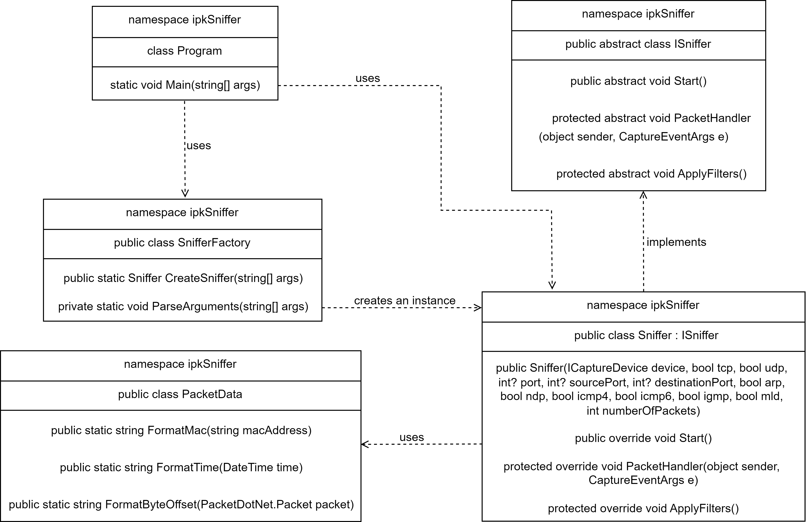

# IPK24-Sniffer

## Author: Movsesian Lilit
## Login: xmovse00

### Description
This program serves as a network analyzer (sniffer) for capturing and filtering packets on a specific network interface. The sniffer is designed to operate in promiscuous mode, which means it captures all packets it receives to the central processing unit, regardless of whether they are intended to sniffer's host. The captured packets are then decoded and meaningful information is printed to the standard output.

### Usage 
The sniffer can be compiled by `make` command, the executable is named `ipk-sniffer`. The sniffer application can be run as following:

    ./ipk-sniffer [-i interface | --interface interface] {-p|--port-source|--port-destination port [--tcp|-t] [--udp|-u]} [--arp] [--ndp] [--icmp4] [--icmp6] [--igmp] [--mld] {-n num}
    ./ipk-sniffer [-i]

    Command Line Interface Arguments:
    -i, --interface: Specify the network interface to sniff. If not specified, a list of active interfaces is printed.
    -p, --port-source, --port-destination: Filter TCP/UDP packets based on port number.
    -t, --tcp: Display TCP segments.
    -u, --udp: Display UDP datagrams.
    --icmp4: Display only ICMPv4 packets.
    --icmp6: Display only ICMPv6 echo request/response.
    --arp: Display only ARP frames.
    --ndp: Display only NDP packets (subset of ICMPv6).
    --igmp: Display only IGMP packets.
    --mld: Display only MLD packets (subset of ICMPv6).
    -n: Specify the number of packets to display. If not specified, only one packet is displayed.

### Implementation

#### Content structuring
The program architecture is organized across 5 files and 5 classes: `Program.cs`, `SnifferFactory.cs`, `ISniffer.cs`, `Sniffer.cs`, `PacketData.cs`. The application structure is described in the following class diagram:

##### Program.cs
`Program` represents the entry point of the application. Within this class, a `Main` method uses `SnifferFactory` to create an instance of `Sniffer` class and invokes its `Start` method.

##### SnifferFactory.cs
`SnifferFactory` is responsible for command-line interface (CLI) arguments parsing and creating instances of Sniffer based on CLI arguments. It contains a method `CreateSniffer`, which is invoked within the `Program` class and a `ParseArguments` method, which is invoked inside the `CreateSniffer` method. `CreateSniffer` method is responsible for extracting a device based on the specified interface and available devices and creating an instance of `Sniffer`. `ParseArguments` method is responsible for manual C-like parsing of arguments without using any tools or libraries.

##### ISniffer.cs
The `ISniffer` class is an abstract interface class and serves as a base for implementing specific packet sniffing functionalities in the derived classes. 

##### Sniffer.cs
`Sniffer` class contains implementation of the abstract methods declared in the `ISniffer` class, generally providing functionality for filtering, capturing and handling packets. The public `Start` method opens the device in promiscuous mode, invokes a method for setting the filters, and registers a callback function to handle packet arrivals. The `ApplyFilters` method constructs and applies packet filters based on the specified CLI arguments. The `PacketHandler` method is invoked whenever a packet is captured, it extracts relevant information from the packet and prints it to the console. If the specified number of packets to capture is reached, it stops the capture process and closes the device.

##### PacketData.cs
`PacketData` is an utility class with public methods for formatting packet data. It contains a `FormatTime` method for formatting the timestamp, a `FormatMac` method for formatting the MAC address and a `FormatByteOffset` method for formatting  hexadecimal and ASCII representation of bytes to the string.

#### Features beyond the assignment
No extra features were implemented in this project.

### Testing
The sniffer was tested manually on the provided reference Linux `IPK24` VM and on the Windows WSL using two terminals for simultaneous operations - one running the sniffer and the other for packet transmission. The sniffer was tested to capture packet protocols specified in the task, as well as for several edge cases of program CLI arguments. Additionally, the sniffer was tested on `eth0` interface and the captured packet was manually cross-referenced against Wireshark results for validation. The project was also tested using automated tests [2]. The following test cases were conducted on Windows WSL.

Test Case 1 - ARP on loopback interface without filtering:

    sudo arping -i lo -c 1 127.0.0.1

    sudo ./ipk-sniffer -i lo

    timestamp: 2024-04-21T12:55:27.066+02:00
    src MAC: 00:00:00:00:00:00
    dst MAC: ff:ff:ff:ff:ff:ff
    frame length: 58 bytes
    src IP: 127.0.0.1
    dst IP: 127.0.0.1

    0x0000: ff ff ff ff ff ff 00 00 00 00 00 00 08 06 00 01  ................
    0x0010: 08 00 06 04 00 01 00 00 00 00 00 00 7f 00 00 01  ................
    0x0020: 00 00 00 00 00 00 7f 00 00 01 00 00 00 00 00 00  ................
    0x0030: 00 00 00 00 00 00 00 00 00 00                    ..........

Test Case 2 - ARP on loopback interface with appropriate filtering:

    sudo arping -i lo -c 1 127.0.0.1

    sudo ./ipk-sniffer -i lo --arp

    timestamp: 2024-04-21T12:56:16.057+02:00
    src MAC: 00:00:00:00:00:00
    dst MAC: ff:ff:ff:ff:ff:ff
    frame length: 58 bytes
    src IP: 127.0.0.1
    dst IP: 127.0.0.1

    0x0000: ff ff ff ff ff ff 00 00 00 00 00 00 08 06 00 01  ................
    0x0010: 08 00 06 04 00 01 00 00 00 00 00 00 7f 00 00 01  ................
    0x0020: 00 00 00 00 00 00 7f 00 00 01 00 00 00 00 00 00  ................
    0x0030: 00 00 00 00 00 00 00 00 00 00                    ..........

Test Case 3 - ARP on loopback interface with inappropriate filtering:

    sudo arping -i lo -c 1 127.0.0.1

    sudo ./ipk-sniffer -i lo --mld
    ^C

Test Case 4 - TCP on loopback interface with appropriate filtering: 

    echo "Hello world" | nc -s 127.0.0.1 -p 4566 127.0.0.1 4568

    sudo ./ipk-sniffer -i lo --tcp --port-source 4566 --port--destination 4568
    
    timestamp: 2024-04-21T12:59:39.650+02:00
    src MAC: 00:00:00:00:00:00
    dst MAC: 00:00:00:00:00:00
    frame length: 74 bytes
    src IP: 127.0.0.1
    dst IP: 127.0.0.1
    src port: 4566
    dst port: 4568

    0x0000: 00 00 00 00 00 00 00 00 00 00 00 00 08 00 45 00  ..............E.
    0x0010: 00 3c ef 24 40 00 40 06 4d 95 7f 00 00 01 7f 00  .<.$@.@.M.......
    0x0020: 00 01 11 d6 11 d8 d1 e4 42 ba 00 00 00 00 a0 02  ........B.......
    0x0030: ff d7 fe 30 00 00 02 04 ff d7 04 02 08 0a cb 2f  ...0.........../
    0x0040: d1 16 00 00 00 00 01 03 03 07                    ..........
    
Test Case 5 - TCP on loopback interface with inappropriate filtering:

    echo "Hello world" | nc -s 127.0.0.1 -p 4567 127.0.0.1 4569

    sudo ./ipk-sniffer -i lo --tcp --port-source 4566 --port--destination 4568
    ^C

Test Case 6 - UDP on loopback interface with inappropriate filtering:

    echo "Hello world" | nc -u -s 127.0.0.1 -p 4550 127.0.0.1 4551

    sudo ./ipk-sniffer -i lo --udp -p 4567
    ^C

Test Case 7 - UDP on loopback interface with appropriate filtering:

    echo "Hello world" | nc -u -s 127.0.0.1 -p 4550 127.0.0.1 4551

    sudo ./ipk-sniffer -i lo --udp -p 4550
    
    timestamp: 2024-04-21T13:01:56.135+02:00
    src MAC: 00:00:00:00:00:00
    dst MAC: 00:00:00:00:00:00
    frame length: 54 bytes
    src IP: 127.0.0.1
    dst IP: 127.0.0.1
    src port: 4550
    dst port: 4551

    0x0000: 00 00 00 00 00 00 00 00 00 00 00 00 08 00 45 00  ..............E.
    0x0010: 00 28 89 17 40 00 40 11 b3 ab 7f 00 00 01 7f 00  .(..@.@.........
    0x0020: 00 01 11 c6 11 c7 00 14 fe 27 48 65 6c 6c 6f 20  .........'Hello
    0x0030: 77 6f 72 6c 64 0a                                world.

Test Case 8 - ICMP4 on loopback interface without filtering:

    ping -c 1 -i lo localhost
    
    sudo ./ipk-sniffer -i lo

    timestamp: 2024-04-21T13:03:13.361+02:00
    src MAC: 00:00:00:00:00:00
    dst MAC: 00:00:00:00:00:00
    frame length: 98 bytes
    src IP: 127.0.0.1
    dst IP: 127.0.0.1

    0x0000: 00 00 00 00 00 00 00 00 00 00 00 00 08 00 45 00  ..............E.
    0x0010: 00 54 c4 f5 40 00 40 01 77 b1 7f 00 00 01 7f 00  .T..@.@.w.......
    0x0020: 00 01 08 00 61 30 2b 04 00 01 91 0e 25 66 00 00  ....a0+.....%f..
    0x0030: 00 00 f1 82 05 00 00 00 00 00 10 11 12 13 14 15  ................
    0x0040: 16 17 18 19 1a 1b 1c 1d 1e 1f 20 21 22 23 24 25  .......... !"#$%
    0x0050: 26 27 28 29 2a 2b 2c 2d 2e 2f 30 31 32 33 34 35  &'()*+,-./012345
    0x0060: 36 37                                            67

Test Case 9 - ICMP4 on loopback interface with appropriate filtering:

    ping -c 1 -i lo localhost
    
    sudo ./ipk-sniffer -i lo --icmp4

    timestamp: 2024-04-21T13:03:57.955+02:00
    src MAC: 00:00:00:00:00:00
    dst MAC: 00:00:00:00:00:00
    frame length: 98 bytes
    src IP: 127.0.0.1
    dst IP: 127.0.0.1

    0x0000: 00 00 00 00 00 00 00 00 00 00 00 00 08 00 45 00  ..............E.
    0x0010: 00 54 cf 71 40 00 40 01 6d 35 7f 00 00 01 7f 00  .T.q@.@.m5......
    0x0020: 00 01 08 00 2b fc 1b 25 00 01 bd 0e 25 66 00 00  ....+..%....%f..
    0x0030: 00 00 01 96 0e 00 00 00 00 00 10 11 12 13 14 15  ................
    0x0040: 16 17 18 19 1a 1b 1c 1d 1e 1f 20 21 22 23 24 25  .......... !"#$%
    0x0050: 26 27 28 29 2a 2b 2c 2d 2e 2f 30 31 32 33 34 35  &'()*+,-./012345
    0x0060: 36 37                                            67

Test Case 10 - ICMP4 on loopback interface with inappropriate filtering:

    ping -c 1 -i lo localhost

    sudo ./ipk-sniffer -i lo --icmp6
    ^C

Test Case 11 - ICMP6 on loopback interface with appropriate filtering:

    ping6 -c 1 -i lo ::1

    sudo ./ipk-sniffer -i lo --icmp6

    timestamp: 2024-04-21T13:04:51.090+02:00
    src MAC: 00:00:00:00:00:00
    dst MAC: 00:00:00:00:00:00
    frame length: 118 bytes
    src IP: ::1
    dst IP: ::1

    0x0000: 00 00 00 00 00 00 00 00 00 00 00 00 86 dd 60 05  ..............`.
    0x0010: ad fa 00 40 3a 40 00 00 00 00 00 00 00 00 00 00  ...@:@..........
    0x0020: 00 00 00 00 00 01 00 00 00 00 00 00 00 00 00 00  ................
    0x0030: 00 00 00 00 00 01 80 00 e6 a0 3a 37 00 01 f3 0e  ..........:7....
    0x0040: 25 66 00 00 00 00 86 62 01 00 00 00 00 00 10 11  %f.....b........
    0x0050: 12 13 14 15 16 17 18 19 1a 1b 1c 1d 1e 1f 20 21  .............. !
    0x0060: 22 23 24 25 26 27 28 29 2a 2b 2c 2d 2e 2f 30 31  "#$%&'()*+,-./01
    0x0070: 32 33 34 35 36 37                                234567

Test Case 12 - ICMP6 on loopback interface with inappropriate filtering:

    ping6 -c 1 -i lo ::1

    sudo ./ipk-sniffer -i lo --icmp4
    ^C

Test Case 13 - NDP on the eth0 interface with appropriate filtering: 
    
    ping6 fe80::1 -c 1
 
    sudo ./ipk-sniffer -i eth0 --ndp
 
    timestamp: 2024-04-21T13:06:18.173+02:00
    src MAC: 00:15:5d:a1:d5:93
    dst MAC: 33:33:ff:00:00:01
    frame length: 86 bytes
    src IP: fe80::215:5dff:fea1:d593
    dst IP: ff02::1:ff00:1

    0x0000: 33 33 ff 00 00 01 00 15 5d a1 d5 93 86 dd 60 00  33......].....`.
    0x0010: 00 00 00 20 3a ff fe 80 00 00 00 00 00 00 02 15  ... :...........
    0x0020: 5d ff fe a1 d5 93 ff 02 00 00 00 00 00 00 00 00  ]...............
    0x0030: 00 01 ff 00 00 01 87 00 15 07 87 00 15 07 00 00  ................
    0x0040: 00 00 fe 80 00 00 00 00 00 00 00 00 00 00 00 00  ................
    0x0050: 00 01 01 01 00 15 5d a1 d5 93                    ......]...

Test Case 14 - NDP on the eth0 interface with ICMP6 filtering: 
    
    ping6 fe80::1 -c 1
 
    sudo ./ipk-sniffer -i eth0 --icmp6

    timestamp: 2024-04-21T13:06:57.001+02:00
    src MAC: 00:15:5d:a1:d5:93
    dst MAC: 33:33:ff:00:00:01
    frame length: 86 bytes
    src IP: fe80::215:5dff:fea1:d593
    dst IP: ff02::1:ff00:1

    0x0000: 33 33 ff 00 00 01 00 15 5d a1 d5 93 86 dd 60 00  33......].....`.
    0x0010: 00 00 00 20 3a ff fe 80 00 00 00 00 00 00 02 15  ... :...........
    0x0020: 5d ff fe a1 d5 93 ff 02 00 00 00 00 00 00 00 00  ]...............
    0x0030: 00 01 ff 00 00 01 87 00 15 07 87 00 15 07 00 00  ................
    0x0040: 00 00 fe 80 00 00 00 00 00 00 00 00 00 00 00 00  ................
    0x0050: 00 01 01 01 00 15 5d a1 d5 93                    ......]...

Test Case 15 - IGMP on loopback interface with appropriate filtering:
    
    test.py:
        from scapy.all import *
        from scapy.contrib.igmp import IGMP
        igmp_query = IP(dst="127.0.0.1")/IGMP(type=0x11)
        send(igmp_query, iface="lo")
    
    sudo python3 test.py
    
    sudo ./ipk-sniffer -i lo --igmp

    timestamp: 2024-04-21T13:10:05.226+02:00
    src MAC: 00:00:00:00:00:00
    dst MAC: ff:ff:ff:ff:ff:ff
    frame length: 42 bytes
    src IP: 127.0.0.1
    dst IP: 127.0.0.1

    0x0000: ff ff ff ff ff ff 00 00 00 00 00 00 08 00 45 00  ..............E.
    0x0010: 00 1c 00 01 00 00 01 02 bb dd 7f 00 00 01 7f 00  ................
    0x0020: 00 01 11 14 ee eb 00 00 00 00                    ..........

Test Case 16 - IGMP on loopback interface with inappropriate filtering:
    
    test.py:
        from scapy.all import *
        from scapy.contrib.igmp import IGMP
        igmp_query = IP(dst="127.0.0.1")/IGMP(type=0x11)
        send(igmp_query, iface="lo")
    
    sudo python3 test.py
    
    sudo ./ipk-sniffer -i lo --icmp6
    ^C

Test Case 17 - MLD on the eth0 interface with appropriate filtering:

    test.py:
        from scapy.all import *
        mld_query = IPv6(dst="ff02::16") / ICMPv6MLReport()
        send(mld_query)
    
    sudo python3 test.py

    sudo ./ipk-sniffer -i eth0 --mld
    
    timestamp: 2024-04-21T13:08:20.737+02:00
    src MAC: 00:15:5d:a1:d5:93
    dst MAC: 33:33:00:00:00:16
    frame length: 78 bytes
    src IP: fe80::215:5dff:fea1:d593
    dst IP: ff02::16

    0x0000: 33 33 00 00 00 16 00 15 5d a1 d5 93 86 dd 60 00  33......].....`.
    0x0010: 00 00 00 18 3a 01 fe 80 00 00 00 00 00 00 02 15  ....:...........
    0x0020: 5d ff fe a1 d5 93 ff 02 00 00 00 00 00 00 00 00  ]...............
    0x0030: 00 00 00 00 00 16 83 00 4a c9 00 00 00 00 00 00  ........J.......
    0x0040: 00 00 00 00 00 00 00 00 00 00 00 00 00 00        ..............

Test Case 17 - MLD on the eth0 interface with ICMP6 filtering:

    test.py:
        from scapy.all import *
        mld_query = IPv6(dst="ff02::16") / ICMPv6MLReport()
        send(mld_query)
    
    sudo python3 test.py

    sudo ./ipk-sniffer -i eth0 --icmp6

    timestamp: 2024-04-21T13:08:50.737+02:00
    src MAC: 00:15:5d:a1:d5:93
    dst MAC: 33:33:00:00:00:16
    frame length: 78 bytes
    src IP: fe80::215:5dff:fea1:d593
    dst IP: ff02::16

    0x0000: 33 33 00 00 00 16 00 15 5d a1 d5 93 86 dd 60 00  33......].....`.
    0x0010: 00 00 00 18 3a 01 fe 80 00 00 00 00 00 00 02 15  ....:...........
    0x0020: 5d ff fe a1 d5 93 ff 02 00 00 00 00 00 00 00 00  ]...............
    0x0030: 00 00 00 00 00 16 83 00 4a c9 00 00 00 00 00 00  ........J.......
    0x0040: 00 00 00 00 00 00 00 00 00 00 00 00 00 00        ..............

Test Case 18 - CLI Arguments:

    sudo ./ipk-sniffer -i --tcp
    
    Error: Interface unspecified.

Test Case 19 - CLI Arguments:
     
    sudo ./ipk-sniffer

    eth0
    any                  Pseudo-device that captures on all interfaces
    lo
    bluetooth-monitor    Bluetooth Linux Monitor
    nflog                Linux netfilter log (NFLOG) interface
    nfqueue              Linux netfilter queue (NFQUEUE) interface
    dbus-system          D-Bus system bus
    dbus-session         D-Bus session bus

Test Case 20 - CLI Arguments:

    sudo ./ipk-sniffer --udp
    
    Error: Invalid arguments.

Test Case 21 - CLI Arguments:

    sudo ./ipk-sniffer -i eth0 --port-source 23 --udp -p 1234
    
    Error: -p argument cannot be specified with --port-source and --port-destination arguments.

Test Case 22 - CLI Arguments:

    sudo ./ipk-sniffer -i eth0 --port-source 23

    Error: --tcp or --udp argument should be specified.

Test Case 23 - CLI Arguments:

    sudo ./ipk-sniffer -i

    eth0
    any                  Pseudo-device that captures on all interfaces
    lo
    bluetooth-monitor    Bluetooth Linux Monitor
    nflog                Linux netfilter log (NFLOG) interface
    nfqueue              Linux netfilter queue (NFQUEUE) interface
    dbus-system          D-Bus system bus
    dbus-session         D-Bus session bus

Test Case 24 - CLI Arguments:

    sudo ./ipk-sniffer -i lo0
    
    Error: Failed to find the specified interface.

Test Case 25 - CLI Arguments:
    
    sudo ./ipk-sniffer --interface
    
    eth0
    any                  Pseudo-device that captures on all interfaces
    lo
    bluetooth-monitor    Bluetooth Linux Monitor
    nflog                Linux netfilter log (NFLOG) interface
    nfqueue              Linux netfilter queue (NFQUEUE) interface
    dbus-system          D-Bus system bus
    dbus-session         D-Bus session bus

The automated tests[2] output: 

    .
    Sent 1 packets.
    ..
    Sent 1 packets.
    ..
    Sent 1 packets.
    ..
    Sent 1 packets.
    ..
    Sent 1 packets.
    ..
    Sent 1 packets.
    ..
    Sent 1 packets.
    ..
    Sent 1 packets.
    .
    ----------------------------------------------------------------------
    Ran 8 tests in 34.496s

    OK

### References
[1]: Veselý, Vladimír. "IPK-Projects-2024/Project 2/zeta". Available at: http://git.fit.vutbr.cz/NESFIT/IPK-Projects-2024/src/branch/master.

[2]: Jeřábek, Jakub. "IPK-Sniffer-Tests". Available at: http://git.fit.vutbr.cz/xjerab28/IPK-Sniffer-Tests/src/branch/main.

[3]: Wikipedia, the free encyclopedia: http://en.wikipedia.org/wiki/Pcap

[4]: Wikipedia, the free encyclopedia: https://en.wikipedia.org/wiki/ICMPv6

[5]: Morgan, Chris; Kaanich, Ayoub; Li, Lex; Pluskal, Jan. "SharpPcap - Official repository. Example3.BasicCap." Available at: https://github.com/dotpcap/sharppcap/blob/master/Examples/Example3.BasicCap

[6]: Morgan, Chris; Kaanich, Ayoub; Li, Lex; Pluskal, Jan. "SharpPcap - Official repository. Example12.PacketManipulation." Available at: https://github.com/dotpcap/sharppcap/blob/master/Examples/Example12.PacketManipulation